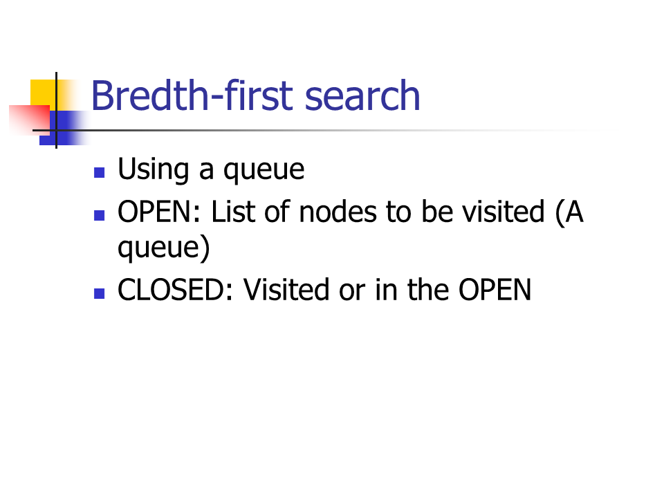
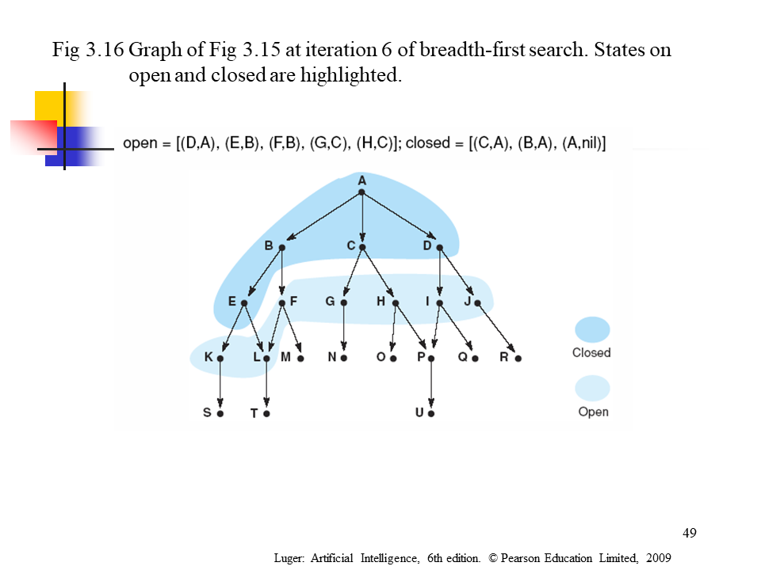
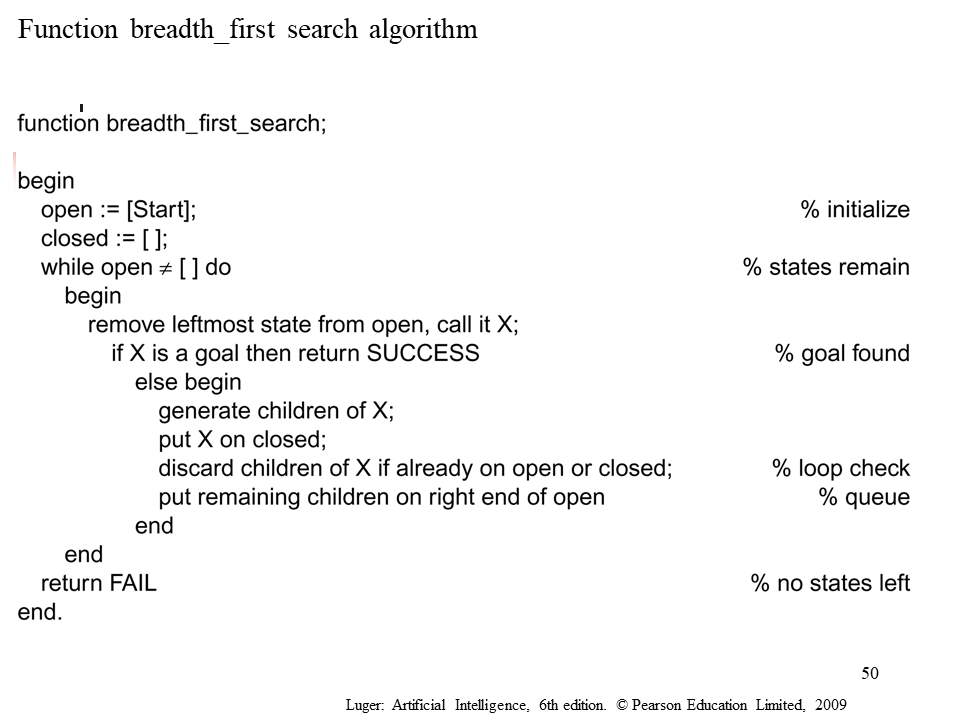
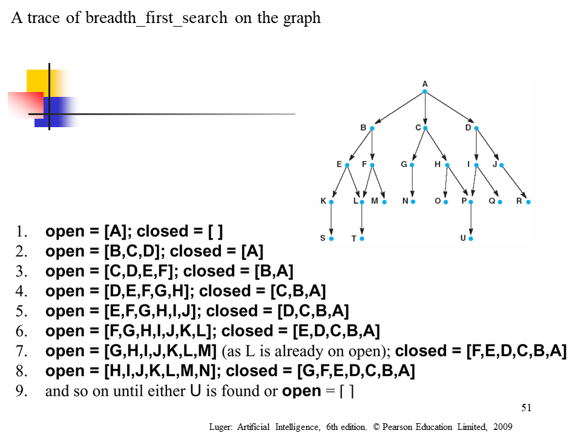

## 7. Pattern: Tree Breadth First Search，**树上的BFS**

这里贴几张以前本科上课的PPT：

再附上我当时的作业实现上面的算法的代码：

~~~python
# Peizhi Han
# CS320 A#2
# 2017/10/23
# Python code:
# Function breadth_first_search algorithm

import sys

graph = {
    'A': ['B', 'C', 'D'],
    'B': ['E'],
    'C': ['G', 'H'],
    'D': ['F'],
    'E': ['F', 'G'],
    'F': ['I'],
    'G': [],
    'H': [],
    'I': []
}

# function breadth_first_search
def bfs(graph, start, goal):		# begin
    global opened
    global closed
    opened = [start]
    closed = []
    while len(opened) != 0:		# while open != [] do
        X = opened.pop(0)		# remove leftmost state from open, call it X
        if X == goal:  			# if X is a goal then return SUCCESS
            closed.insert(0, X)
            return True
        else:  # else
            closed.insert(0, X)		# put X on closed
            chil = graph[X]		# generate children of X
            tmp = []
            # the children of X if is not already
            for elemt in chil:		# on open or closed
                if not (elemt in opened) and not (elemt in closed):
                    tmp.append(elemt)
            opened += tmp		# put remaining children on right end of open
    return False			# bfs => opened += tmp

# trace the solution,
# this alg is not good as dfs,
# because of the efficiency,
# but can do good as dfs, same result
def trace(closed, start, goal):
    sol = [goal]
    tmp = goal
    while not(tmp == start):
        for k,v in graph.items():
            if tmp in closed:
                if tmp in v:
                    tmp = k
                    sol.append(k)
                    break
    sol.reverse()
    print('trace solution: ', sol)

# main():
Start = 'A'  # set the start state
Goal = 'I'  # set the goal to search

if bfs(graph, Start, Goal):  # if find the goal state
    print('Find The Goal!\nclosed = ', closed)
    print('open = ', opened)
else:
    print(Goal, ': NOT FIND!')  # if not find the goal state

trace(closed, Start, Goal)
~~~

-----

  

这种模式基于宽搜（Breadth First Search (BFS)），适用于需要遍历一颗树。借助于队列数据结构，从而能保证树的节点按照他们的层数打印出来。打印完当前层所有元素，才能执行到下一层。所有这种需要遍历树且需要一层一层遍历的问题，都能用这种模式高效解决。

这种树上的BFS模式是通过把根节点加到队列中，然后不断遍历直到队列为空。每一次循环中，我们都会把队头结点拿出来（remove），然后对其进行必要的操作。在删除每个节点的同时，其孩子节点，都会被加到队列中。

识别树上的BFS模式：

- 如果你被问到去遍历树，需要按层操作的方式（也称作层序遍历）

**经典题目：**

Binary Tree Level Order Traversal (medium)

Reverse Level Order Traversal (easy)

Zigzag Traversal (medium)

Level Averages in a Binary Tree (easy)

Minimum Depth of a Binary Tree (easy)

Level Order Successor (easy)

Connect Level Order Siblings (medium)