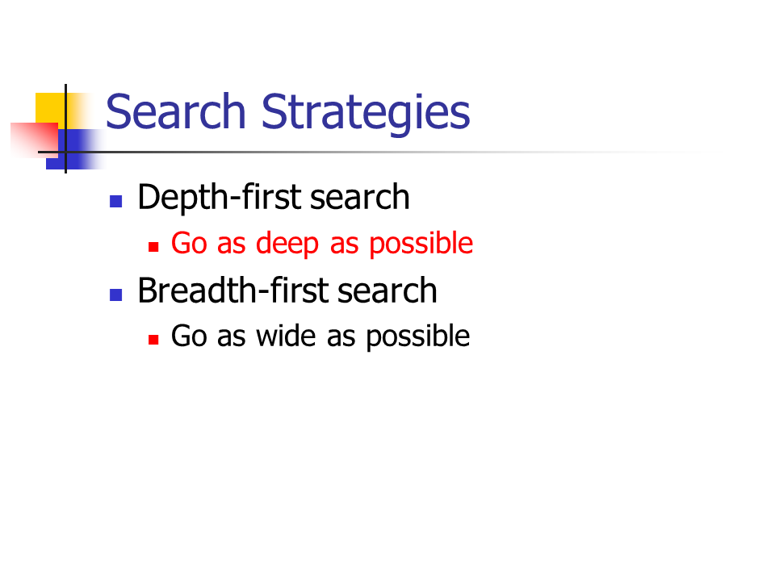
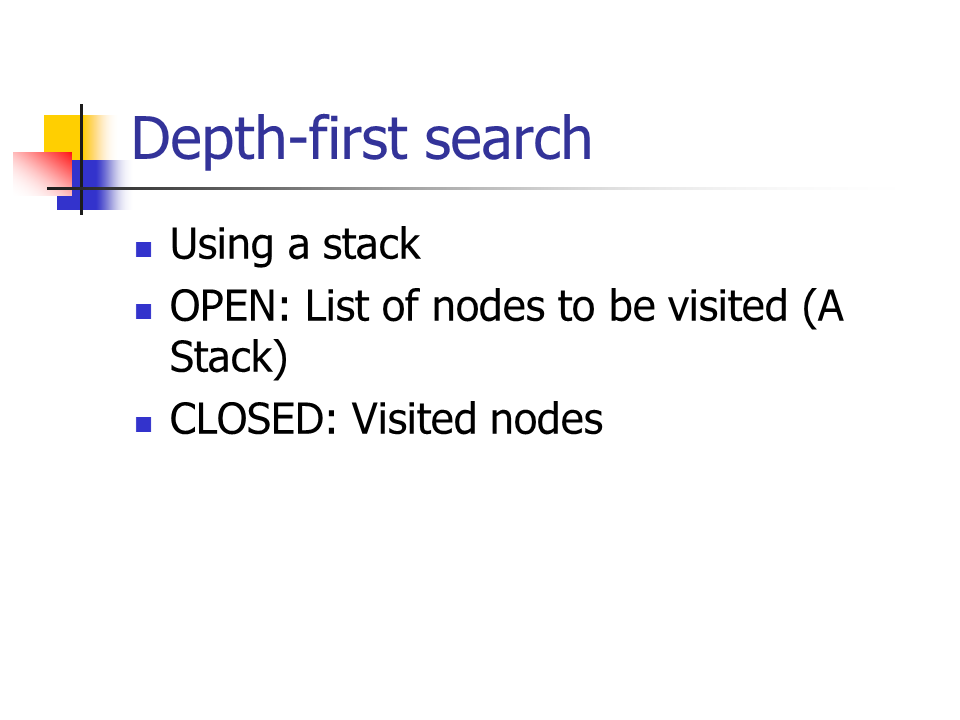
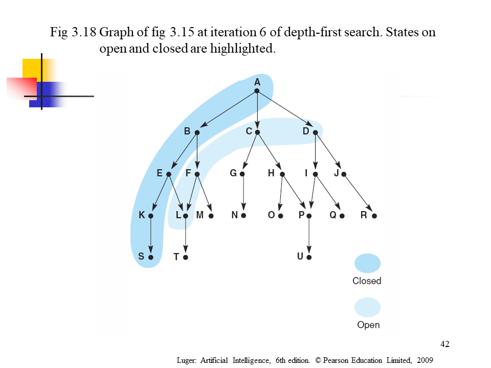
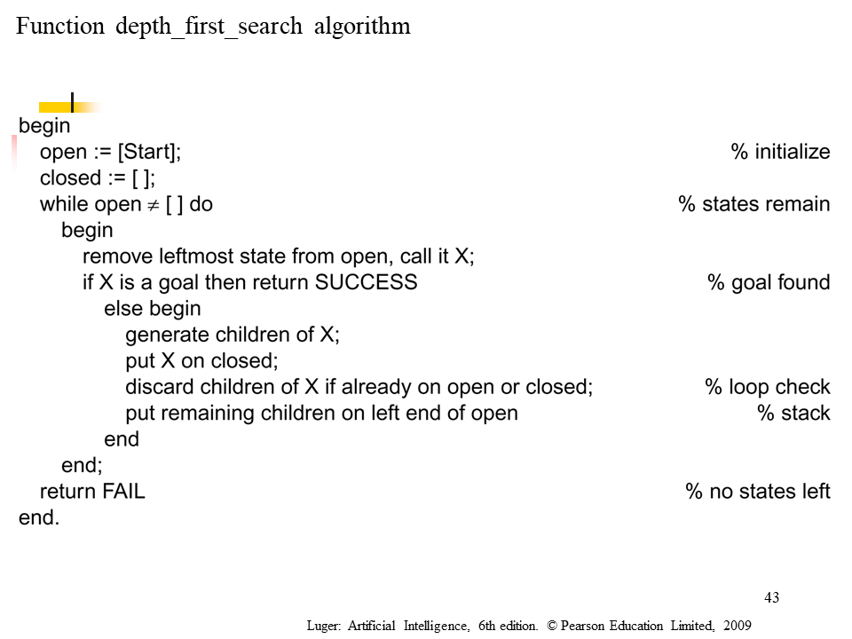
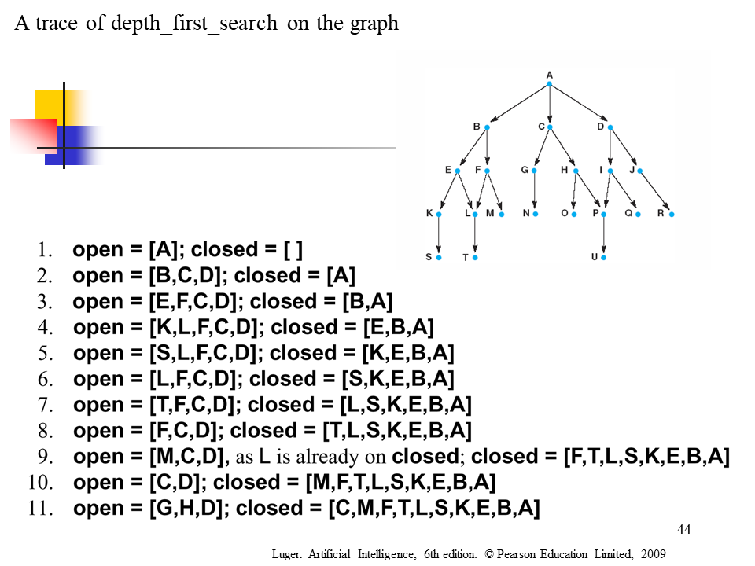

## **Pattern: Tree Depth First Search，树上的DFS**

**经典题目：**

- [ ] Binary Tree Path Sum (easy)

- [ ] All Paths for a Sum (medium)

- [ ] Sum of Path Numbers (medium)

- [ ] Path With Given Sequence (medium)

- [ ] Count Paths for a Sum (medium)